# Reverse Engineering a Map  

Presented by:  
### Phil White
### Earth, Environment & Geospatial Librarian
### [philip.white@colorado.edu](mailto:philip.white@colorado.edu)  

## Prerequisites:
- A Mapbox account: [Sign Up](https://account.mapbox.com/auth/signup/)
- [QGIS](https://qgis.org/en/site/) (free!) or ArcGIS installed on your computer (we will use desktop GIS briefly to prepare data, you could get by without it for this workshop, but you'll want it to fully participate)

## Agenda:
1. Let's read the news!
2. Thinking about the technology...
3. Sluething the data
4. A little bit of data processing
5. Rebuilding the map  

## First, why?  
Why not? Examining a map and thinking about how it was made and what sort of data was used to create it is a great way to learn about data and tools for visualizing data.

## Did you see the news?  

Who here is not a fanatic for the New York Times data visualizations?!  

From last Monday (2/7/22): [The Tsunami Could Kill Thousands. Can They Build an Escape?](https://www.nytimes.com/2022/02/07/us/tsunami-northwest-evacuation-towers.html) Hey! Cool maps! How'd they make those?

## The tech:  
Keen observers will note that the maps published by the New York Times are usually made using [Mapbox](https://www.mapbox.com/). Mapbox, at it's core, is a JavaScript library, but there is also a pretty nifty GUI interface for making custom webmaps, [Mapbox Studio](https://studio.mapbox.com/). We will use Mapbox Studio to generate an approximation of the tsunami potential map.

- See: [How The Times Makes Those Addictive Election Maps](https://www.nytimes.com/2018/11/04/reader-center/how-we-cover-elections-interactive-maps.html)
- See: [All the maps that are fit to print](https://www.mapbox.com/showcase/the-new-york-times)  

## Sluething the data:

Here we have maps that present a lot of GIS data... So much data!  
But the biggie here is
- Tsunami flood scenarios... Where does this data come from?  
- What other sources of data are listed here? Not much actually!
  - [OpenStreetMap](https://www.openstreetmap.org/#map=5/38.007/-95.844), what is it?  

## About the data  

Once we've [found the data](https://www.dnr.wa.gov/programs-and-services/geology/publications-and-data/gis-data-and-databases), we need to understand what format the data is in and how we can use it.  

The Washington Department of Natural Resources provides this data as a [File Geodatabase](https://desktop.arcgis.com/en/arcmap/latest/manage-data/administer-file-gdbs/file-geodatabases.htm). What is a file geodatabase? Well, it is essentially a package that contains multiple data sets or "layers" in GIS terms.

The problem with a geodatabase is that it is a closed, proprietary standard created by Esri, the 900 lb gorilla of GIS. Do we need Esri's GIS software, such as ArcGIS, to use a GDB? Not necessarily...

We can use QGIS, a free and open source GIS system to read and review the data and export it to something we can work with.  

Here is a nice [step-by-step guide for getting the GDB into QGIS](https://www.northrivergeographic.com/qgis-using-esris-file-based-geodatabase).

Then, you just need to figure out the layer you need, right-click > Export it as a shapefile. :-) We will demo this, but the easiest way is to just drag and drop the gdb folder onto the QGIS canvas:  

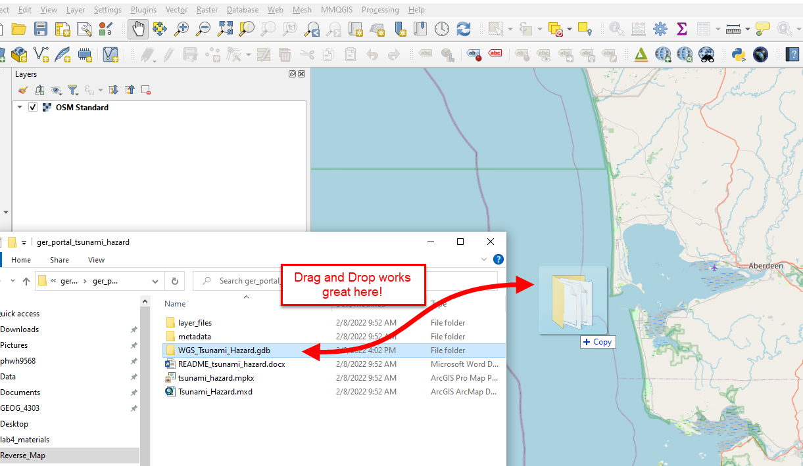  

You'll need to explore the data to figure out which feature you need to export...  In our case it's OID 59. You'll need to select it either visually with the Select tool or by clicking on it in the attribute table. Once it's selected, it will appear yellow:  

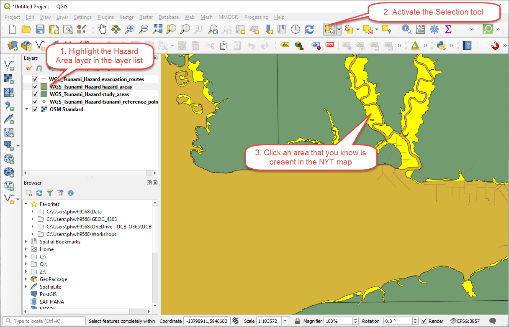

Next, right click the layer and choose Export > Save Selected Features as:  

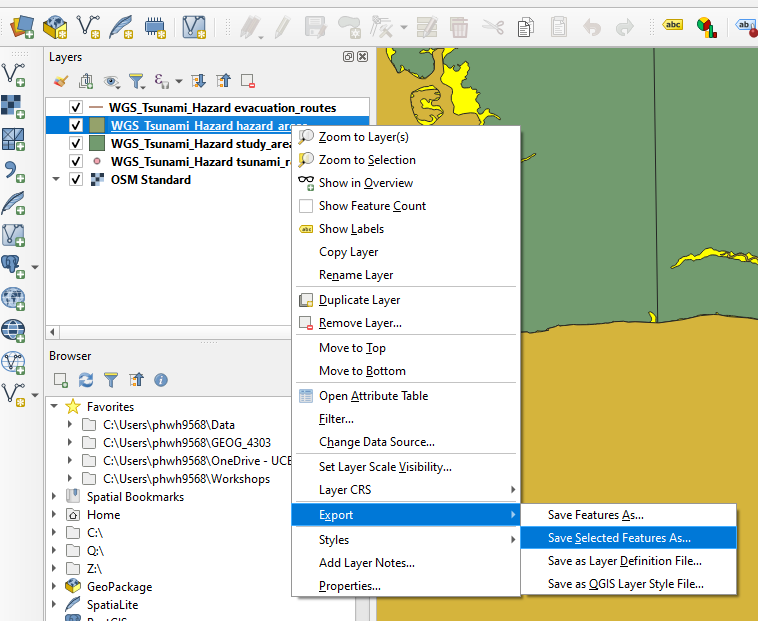  

Save it as a shapefile:  

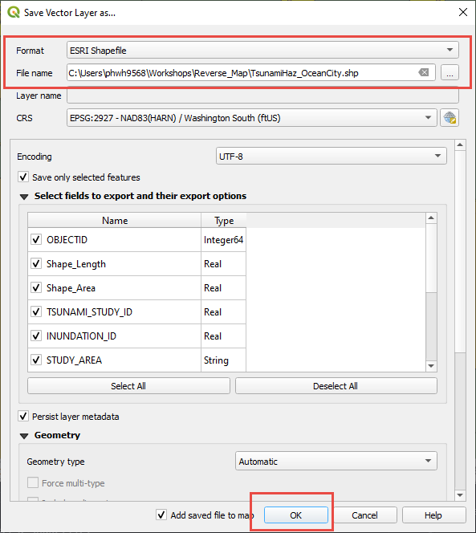  

Finally, put the shapefile and all associated files into a zipped folder:  

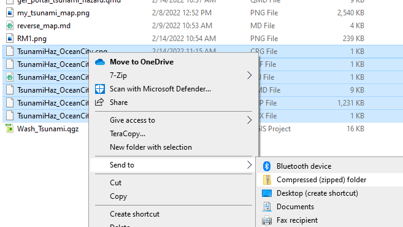

## Now let's recreate that map in Mapbox Studio  

Mapbox is a leader in web mapping technologies and offers some pretty nifty tools for people of various technical experience levels.  

Head over to your [Mapbox Studio account](https://studio.mapbox.com/) and click the new style button:  

  

For this example, we'll choose Monochrome, Light, then click Customize Monochrome:  

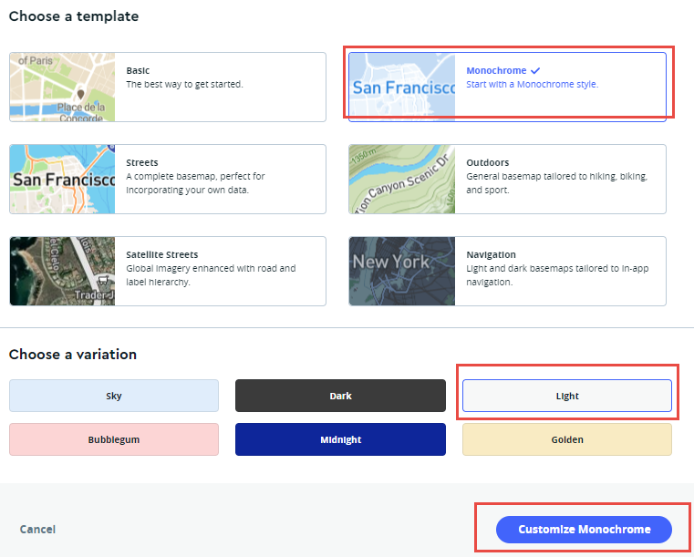  

Zoom in on the Ocean Shore/Aberdeen, WA area.  

By clicking Layers, you can view all of the individual layers present on this web map. These are largely layers that are freely available from OpenStreetMap!  

First we will add our tsunami hazard shapefile. Click Layers, then the plus sign to add our own layer:  

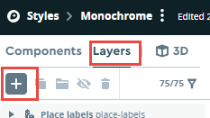  

Next choose Upload Data:  

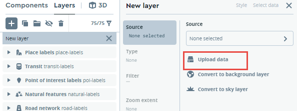  

Drag and drop your zipped shapefile into the upload dialog box:  

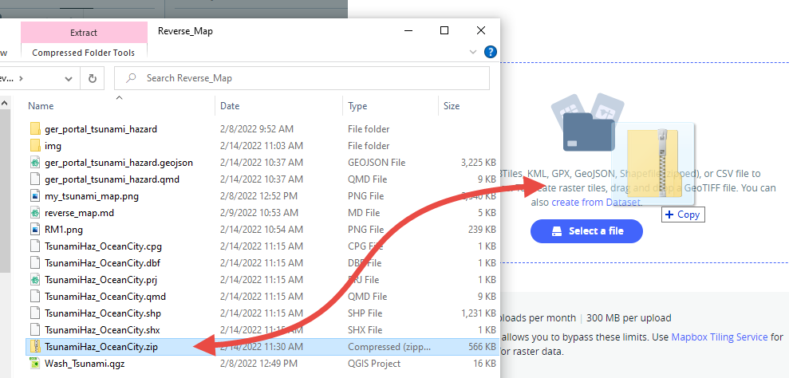  

Click confirm and wait for the upload to complete....  

Once the upload has completed successfully, under Source, choose 'none selected' then select your newly uploaded layer:  

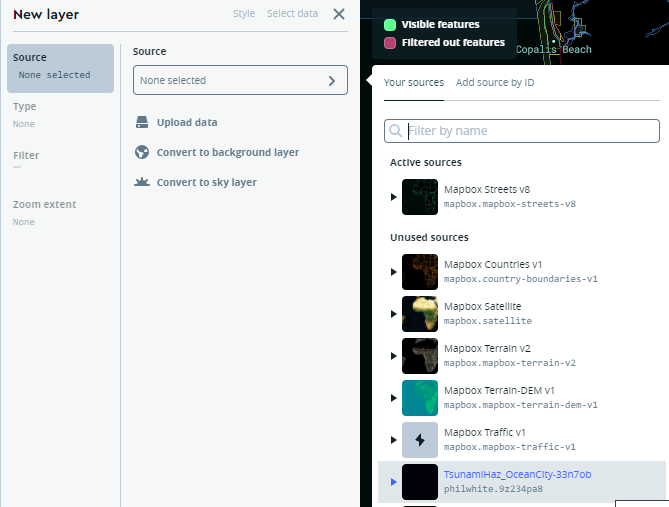  

Your layer will be added in all black. Click the icon next to it under Layers and you can change the color:  

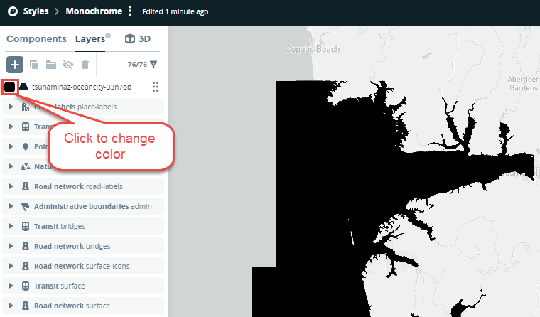  

You can use the color tools, or enter a color code in manually. The code for the 'darkorange' color used on the NYT map is: #f8931d  

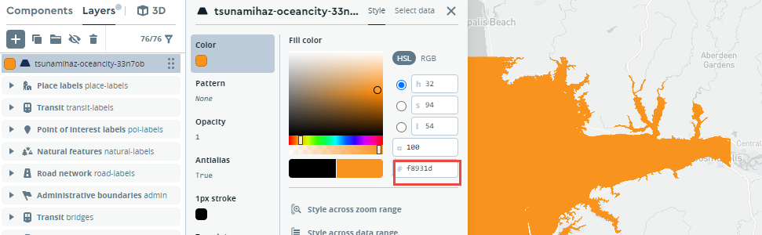  

Now, we can change the "drawing order" of the layers to move the orange layer beneath the water layer, but above the land layer, so that only the modeled inundated areas appear. Simply "grab" the layer and drag to place it beneath the water layer:  

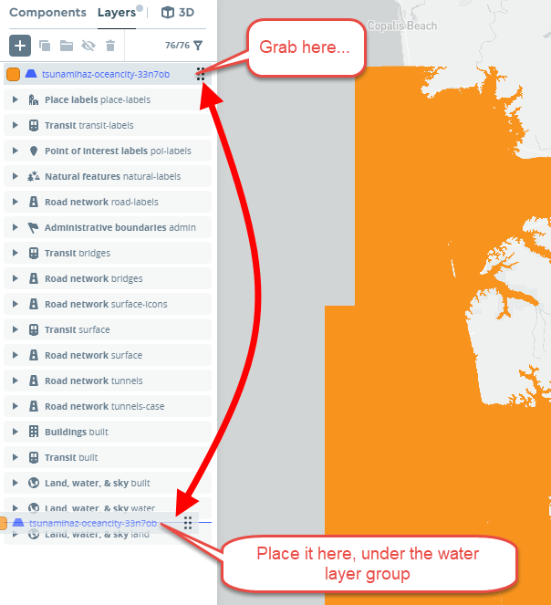

HEY! NOT BAD! You're 90% of the way there! :-)  Now it's all about just tweaking the colors etc.  You can change the ocean color to the same as the NYTimes map the same way we changed the inundated areas color. The color code is: #3d5b66  (hint: you will need to click the override button)

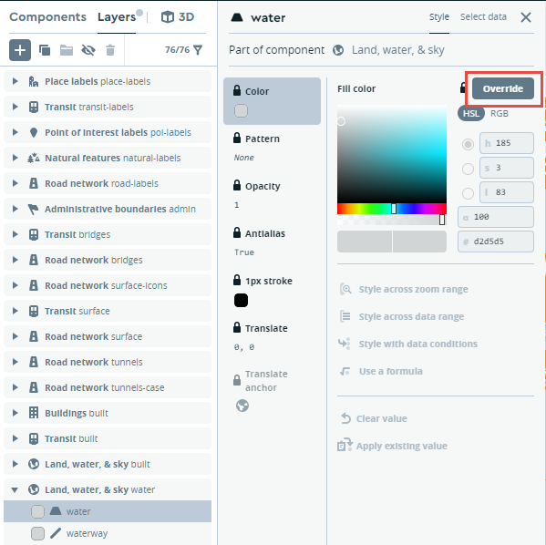  

Want to add hillshade? Easy! Add a layer as before, except set the source to 'Mapbox Terrain-DEM v1'. This will add a nice looking hillshade layer to your map:  

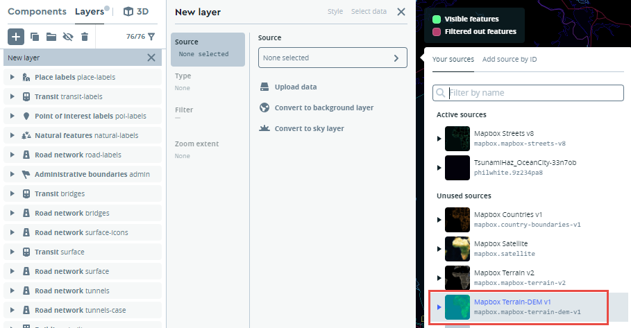  

From here is tweak, play, customize, and EXTEND to your heart's content. But when it's time to share, you can do so easily.

First click Publish:  

  

Then click Share. In the share dialog box, you'll have several options for sharing by either a direct link, an embed, or link to the map tiles that you can plug into other sources. But importantly, you'll need to make public first:  

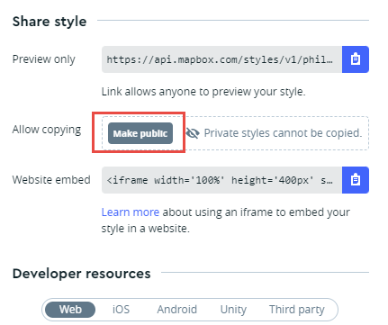  

That's it! NYTimes does a lot more customization, which you could explore further. But, in terms of reverse engineering for the sake of recreating and learning about the data and tech, you've done it! Nice job!

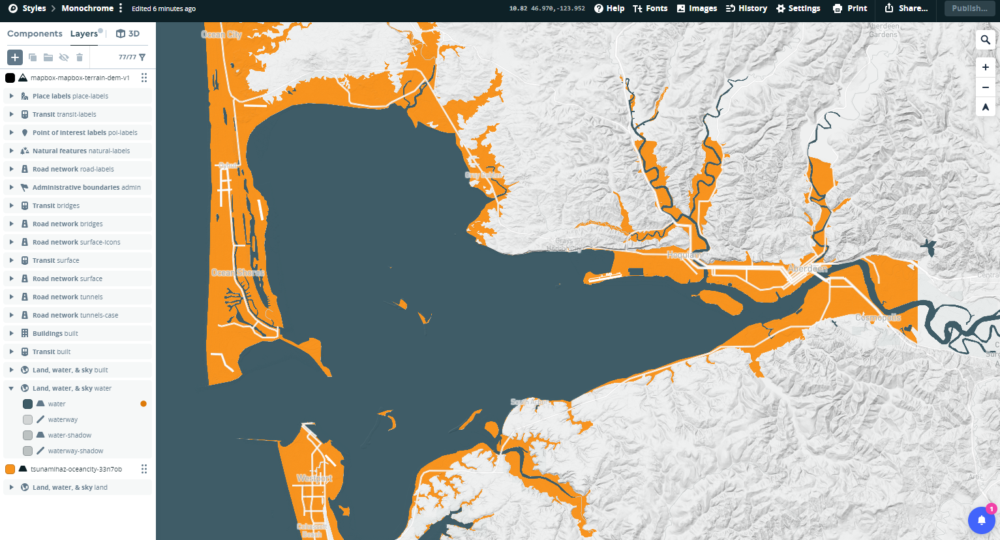  
